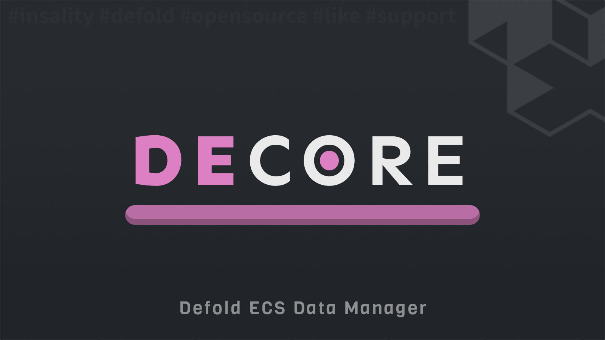

[](https://github.com/Insality/decore/tags)
[](https://github.com/Insality/decore/actions)
[](https://codecov.io/gh/Insality/decore)

[](https://github.com/sponsors/insality) [](https://ko-fi.com/insality) [](https://www.buymeacoffee.com/insality)


# Disclaimer

The library in development stage. May be not fully tested and README may be not full. If you have any questions, please, create an issue.


# Decore

**Decore** - a Defold library for managing ECS game entities and components in a data-driven way. It provides functionality for creating and managing game entities with their components.

## Features

* **Entity Management**: Create and manage game entities
* **Component Management**: Add, remove and update entity components
* **Easy Integration**: Simple setup and integration with Defold projects

## Installation

Add in your `game.project` dependencies:
```
https://github.com/Insality/decore/archive/refs/tags/1.zip
```

## Quick API Reference

```lua
local decore = require("decore.decore")

decore.world(...)
decore.on_input(world, action_id, action)
decore.on_message(world, message_id, [message], [sender])
decore.final([world])

decore.system(system_module, system_id, [require_all_filters])
decore.processing_system(system_module, system_id, [require_all_filters])
decore.sorted_system(system_module, system_id, [require_all_filters])
decore.sorted_processing_system(system_module, system_id, [require_all_filters])

decore.register_entity(entity_id, entity_data, [pack_id])
decore.register_entities(pack_id, entities)
decore.unregister_entities(pack_id)

decore.register_component(component_id, [component_data], [pack_id])
decore.register_components(components_data_or_path)
decore.unregister_components(pack_id)

decore.create_entity([prefab_id], [pack_id], [data])
decore.create_component(component_id, [component_pack_id])
decore.apply_component(entity, component_id, [component_data])
decore.apply_components(entity, [components])

decore.get_entity_by_id(world, id)
decore.find_entities_by_component_value(world, component_id, [component_value])
decore.is_alive(world_or_system, entity)

decore.print_loaded_packs_debug_info()
decore.print_loaded_systems_debug_info(world)
decore.parse_command(command)
decore.call_command(world, [command])

decore.set_logger([logger_instance])
decore.get_logger(name, [level])
```

## License

This project is licensed under the MIT License - see the LICENSE file for details.

## Issues and suggestions

If you have any issues, questions or suggestions please [create an issue](https://github.com/Insality/decore/issues).

## ❤️ Support project ❤️

Your donation helps me stay engaged in creating valuable projects for **Defold**. If you appreciate what I'm doing, please consider supporting me!

[](https://github.com/sponsors/insality) [](https://ko-fi.com/insality) [](https://www.buymeacoffee.com/insality)
